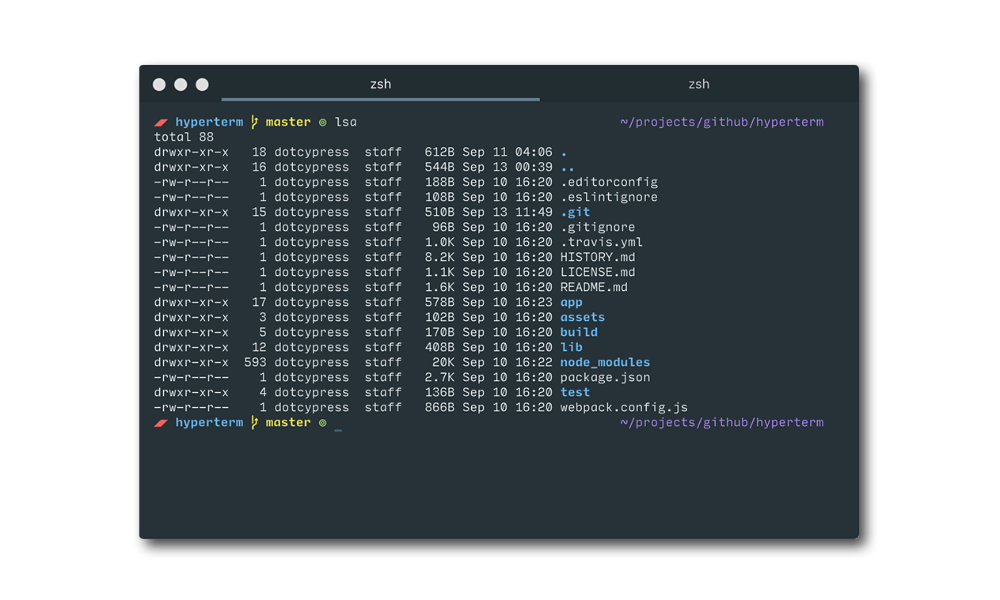

# hyper-material

Material theme for [Hyper.app](https://hyper.is).


## Install

Add `hyper-material` to your plugins list in `~/.hyperterm.js`:

```js
plugins: [
  // a list of plugins to fetch and install from npm
  // format: [@org/]project[#version]
  // examples:
  //   `hyperpower`
  //   `@company/project`
  //   `project#1.0.1`
  plugins: [
    'hyper-material'
  ]
]
```
